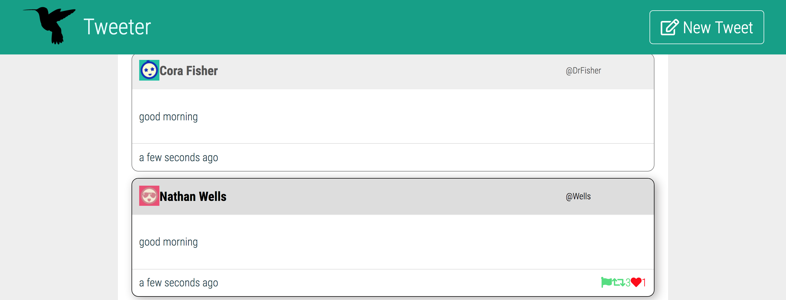

# Tweeter Project

Tweeter is a simple, single-page Twitter clone.

## Feature
* Tweeter is a simple, single-page Twitter clone using HTML, CSS, JS, jQuery and AJAX on the front-end, and Node, Express and MongoDB on the back-end. Tweets create webAPP user experience with AJAX and data are persisted and survice server restart.

* Tweeter is a responsive web app, and can satisfy both Mobile users and Desktop users. For improve user experiences, the front-end webpage include flash error message, toggle form, gradient, css-animation feature

* Tweeter support posting, reposting, and liking feature where user and post a tweet, repost someone's tweets or like a tweet. The liking/unliking status, as well as the number of repost is shown

## Demo

## Getting Started

1. Fork this repository, then clone your fork of this repository.
2. Install dependencies using the `npm install` command.
3. Start the web server using the `npm run local` command. The app will be served at <http://localhost:8080/>.
4. Go to <http://localhost:8080/> in your browser.

## Dependencies
*  "body-parser": "^1.15.2",
*  "chance": "^1.0.2",
*  "express": "^4.13.4",
*  "md5": "^2.1.0",
*  "moment": "^2.22.2",
*  "mongodb": "^2.2.36",
*  "node-sass-middleware": "^0.11.0"

## Special Features 
* Repost / repost count - user is able to repost any tweets and see how many time this tweet has been reposted
